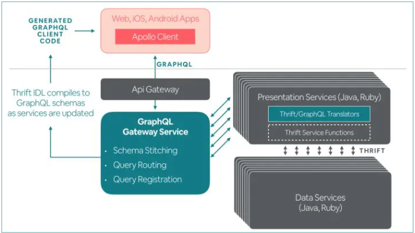
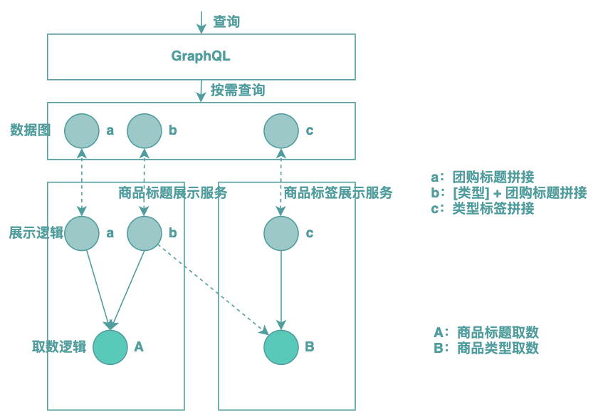
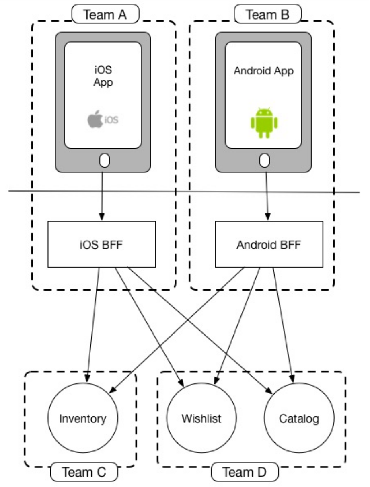
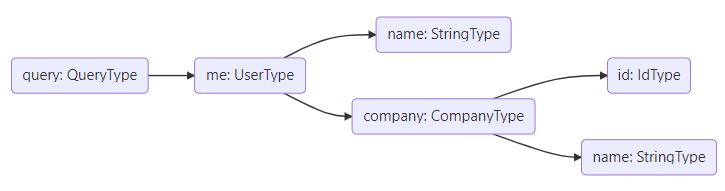

初识GraphQL

最近项目上接触到了GraphQL，但由于对其的理解很不足，应用的时候出现了很多问题和困扰。
此外，GraphQL据说是为了替代RestFul，但在为数不多的实践中，GraphQL
并没有像Docker、K8S那样带给人直观的颠覆性体验，可能随着使用经历的增加，会有新的体会吧。
本文属入门性质，分两部分：
- GraphQL与RestFul、SQL、BFF的对比
- GraphQL基础


## GraphQL与RestFul、SQL、BFF的对比
### 对比RESTFul
严格来说，RESTFul与GraphQL并不是一个层面的东西。
REST是一种架构风格，即表述性状态传递（Representational State Transfer），是Web API实现的约束，提倡客户端和服务器以无状态模式交换信息。
GraphQL则是Web API的查询语言，由Facebook于2015年开源，它既不是架构风格，也不是Web服务，可以看作一个中介，用来查询从各种数据源（数据库、Web服务等）接收的数据。
#### REST的优点
1. REST规范有助于统一API的设计，使得API适用于各种前端设备；
2. REST将业务逻辑抽象为对资源的操作，容易理解；
3. 基于资源的抽象，有利于构建更稳定的服务；

#### REST的缺点
1. API粒度较粗，使用时存在过度获取（Over-fetch）、获取不足(Under-fetch)的问题
2. 面向资源的一个弊端就是当需要获取关联的资源时，需要进行多次数据交互，比如“文章->评论->评论回复”
#### GraphQL所解决的问题
1. 对于粒度问题，GraphQL细化到了字段级别，客户端可以自行决定需要服务端返回的字段
2. GraphQL支持Model的关联查询，对类似“文章->评论->评论回复”这样的需求，可以一次性返回
此外还有一些帖子宣称的GraphQL的优点
>1.客户端驱动，由客户端来决定服务端返回什么样的Response
>2.API版本控制，由于GraphQL将粒度细化到了字段级别，版本控制也可以做到字段级别，RESTFul的粒度则是资源（uri）级别
>3.强类型...

#### GraphQL的缺点
GraphQL在解决Rest存在的问题的同时，也引入了新的问题：
1. 缓存功能不成熟，相比使用REST API，为GraphQL实现缓存要付出更多的努力；
2. GraphQL暴露了服务端的数据模式，这基本上也就让使用者获取到了服务端的数据结构，使得服务端更容易被攻击；
3. GraplQL目前没有关于身份验证和授权的原生解决方案，需要在业务逻辑层单独实现；

### 对比SQL
最近刚刚接触GraphQL，不知为啥从一开始听到这个技术，就对其带有一丝偏见，也许是因为它有个“蹭热度”形式的名称吧。
Graph-QL与(S)tructured-QL名称相识，难道是因为Structured这个词被占用了，就换个更高端Graph？
以我粗浅的理解，两者不仅名称类似，还存在很多相似的地方。
1. 语法可以相互转换
比如GraphQL查询Movie
```
{
  Movie(id: "m1") {
    id
    title
  }
}
```
对应的SQL查询为：
```
SELECT id, title FROM Movies WHERE id = "m1"
```
2. REST API，GraphQL, SQL都是对数据进行查询、变更，其中GraphQL和SQL的粒度相同，都是字段级别
3. GraphQL将拼好的查询语句，通过HTTP POST的方式发送给服务端解析，那么同样可以将拼好的SQL发送给服务端，类似web 形式的sql执行工具

综上，两者有这么多相似的地方，那么GraphQL是否可以看作给Responses增加了类型的SQL？带着这些疑惑查阅了一些资料，找到了一些比较认同的说法：
1. GraphQL在数据层的基础上增加了抽象，除了DB，它的数据提供方还可以是任何数据存储或服务；
2. 基于这种抽象，Graph可以隐藏数据的存储结构，并控制要在API中显示的内容；

### 对比BFF
相对于RestAPI，GraphQL最大的优势是可以按需获取、关联获取，减少不必要的数据传输和网络请求次数。
而BFF貌似做的也是类似的事情：裁剪后端返回的数据，按需组织后返回给客户端；如果所需的数据来自多个后端服务，可以对这些服务进行编排，前端只需一次请求，剩下的多次请求交给BFF来做，BFF与后端服务如果处于同一个服务集群，其间的网络交互速度会很快。
所以，看起来BFF与GraphQL解决的都是按需获取、减少网络请求次数的问题，这就让人很困惑，GraphQL这玩意说解决RestAPI的痛点吧，又带来了新的问题；蹭了个类似SQL但高大上的名字，干的事情咋一看又类似SQL；还跟BFF的功能类似，难不成“替代”完RestAPI，又打算替代BFF？
Google搜索关键词“GraphQL替代BFF”，得到的结果却是很多类似“微服务下基于GraphQL构建BFF”之类的实践，看过内容后，不得不感叹“八仙过海，各显神通”，应了那句老话“没有银弹”，适合自己的才是最好的，毕竟人家的方案解决了自家场景下的问题，还带来了效率的提升。

在这些文章中，找到一个有代表性的搞法：将BFF分为“前端BFF”和“后端BFF”，其中“后端BFF”适合用GraphQL来建设。什么，BFF还分前后端吗？这要从BFF层的归属说起。
BFF作为服务于前端的后端，尝试解决的是服务端单一业务功能与不同客户端间差异性之间的矛盾。通过引入BFF层，将原先后端与前端之间的矛盾，转移到了BFF与前端之间，由BFF来专门负责不同端的适配，这样后端就可以专注于提供稳定的业务功能了。
BFF也是通过增加分层来解决问题的思路，但在前端、后端之间增加的这一层该归属谁由谁来维护呢？如果归属给前端，就是“前端BFF”，反之就是“后端BFF”。

#### 后端BFF
这种后端BFF模式，目前最广泛的实践是基于GraphQL来搭建的，后端将展示字段封装成展示服务，通过GraphQL编排之后暴露给前端使用。详情请查看https://tech.meituan.com/2021/05/06/bff-graphql.html。


这种模式下，后端不需要关心前端的差异性需求，由GraphQL提供按需查询的能力，这样可以很好地应对不同场景下展示字段的差异。在GraphQL BFF这一层进行服务的编排和查询的聚合。

#### 前端BFF

可以将前端BFF看作前端的一部分，由前端团队来开发，这种模式的理念是，本来能一个团队交付的需求，没必要拆成两个团队，两个团队本身带来较大的沟通协作成本。本质上，是一种将“敌我矛盾”转化为“人民内部矛盾”的思路。前端完全接手BFF的开发工作，实现数据查询的自给自足。这种模式下，使用GraphQL的收益不如后端BFF。


## GraphQL基础
GraphQL支持三种操作符：
- Query
- Mutation
- Subscription
### Queries
对于每个GraphQL Server来说，Query操作符是必须要提供的。Query操作符类似Rest API的GET请求，用于执行无副作用的请求，不会改变服务器的状态，因此GraphQL引擎在解析并执行查询语句时，对于同一层级的属性，是并行执行的。
#### 配置ASP.NET CORE服务器支持Query
在.net 6.0中，要配置ASP.NET CORE服务器支持Query，只需安装Nuget包`HotChocolate.AspNetCore`并执行如下操作（除了HotChocolate，还可以使用graphql.net等框架）：
1. 添加Query Class:
```
public class Query
{
    public IQueryable<Movie> GetMovies([Service] ApplicationDbContext context) =>
        context.Movies;
}
```
其中Movie长这样，它有关联表Superhero：
```
public class Movie
{
    [Key]
    public Guid Id { get; set; }
    [Required(ErrorMessage = "The movie title is required")]
    public string Title { get; set; }
    public string? Description { get; set; }
    public string? Instructor { get; set; }
    public DateTime ReleaseDate { get; set; }

    [ForeignKey("SuperheroId")]
    public Guid SuperheroId { get; set; }
    public Superhero Superhero { get; set; }
}
```
2. 配置ASP.NET CORE服务器支持Query
```
builder.Services
    .AddGraphQLServer().AddQueryType<Query>();
```
经过这两步，一个支持Query操作的GraphQL Server就build好了。
为了能查询到数据，还需要配置EF Core和HotChocolate.Data.EntityFramework组件。
启动程序，在执行第一次Query请求时，服务器会生成GraphQL的Schema（也叫SDL），类似这样：
```
type Query {
  movies(): [Movie!]!
}

type Movie {
  id: UUID!
  title: String!
  description: String
  instructor: String
  releaseDate: DateTime!
  superheroId: UUID!
  superhero: Superhero!
}

type Superhero {
  id: UUID!
  name: String!
  description: String!
  height: Float!
  superpowers: [Superpower!]!
  movies: [Movie!]!
}
```
HotChocolate自带的客户端名为`Banana Cake Pop.`,可通过`http://localhost:<port>/graphql/`来访问，第一次进去需要点击`Create Document`创建连接。
在这里可以灵活得查询Movie相关的属性：
- 可以只查询Movie中我们需要的属性（图1）
- 可以查询Movie的关联表（图2）
- 设置可以根据关联表superHero反查相关的Movie（图2）


### 命名约定
本次使用的框架时HotChocolate，它会自动根据我们定义的Class，将其转换为GraphQL的Schema。
对比上文中的C#类`Movie`与GraphQL的Schema`Movie`，可以发现两者的关系：
- 首先Query.GetMovies方法的前缀Get默认被移除
- 首字母小写
- Query中的方法可以添加async来进行异步化，但这不会体现在SDL中

也可以使用注解来自定义名称之间的映射关系：
```c#
[GraphQLName("BookAuthor")]
public class Author
{
    [GraphQLName("fullName")]
    public string Name { get; set; }
}
```

### 数据类型
除了名称的转换，c#中的数据类型也要映射到GraphQL的类型。
GraphQL中常用的数据类型有Object Type和Scalar两类，此外还有Enums，Interfaces, Unions等。
其中Object Type会对应为c#的class，Scalar大致对应c#中的一部分值类型。
比如String, Boolean, Int都可以一一对应，但GraphQL还有一种特殊的类型ID，在C#中实现时可以使用string，int，Guid，同时显式地进行映射：
```
[GraphQLType(typeof(IdType))]
public int Id { get; set; }
```

```
query {
  movies{
    title,
    description,
    superhero{
      name,
      superpowers{
        superPower,
      }
    }
  }
}
```
### Mutations
Mutation操作符用来新增、修改、删除数据，
首先还是创建Mutation class（名称不限）
```
public class Mutation
{
    public Movie UpdateMovie(string description, [Service] ApplicationDbContext context)
    {
        context.Movies.First().Description = description;
        context.SaveChanges();
        return context.Movies.First();
    }
}
```
然后借助Hot Chocolate提供地扩展方法注册以暴露Mutation接口：
```
builder.Services
    .AddGraphQLServer()
    .AddMutationType<Mutation>();
```
Mutation类中需要提供变动数据地方法，这里的UpdateMovie只是简单地改变第一条数据。启动程序，就可以编写GraphQL语句来试验了
```
mutation { // 指定mutation操作符
  updateMovie(description: "fakeDesc12"){ // 调用UpdateMovie，并传参description
    description // UpdateMovie操作结束后会同时返回最新的Movie信息，这里可以继续查询
  }
}
```

### Subscriptions
Subscription操作符可以使客户端订阅服务端的事件，通常用于需要实时监听服务端数据变化时。
创建MovieAdded事件，以及处理方法（这里只是拿到string消息后简单地返回）：
```
public class Subscription
{
    [Subscribe]
    public string MovieAdded([EventMessage] string movie) => movie;
}
```
编写服务端发送事件的逻辑：
```
public class Mutation
{
    ...
    public async Task<string> AddMovieWithEvent(string movie, [Service] ITopicEventSender sender)
    {
        await sender.SendAsync(nameof(Subscription.MovieAdded), movie);
        return $"Movie created, title: {movie}, event sent";
    }
}
```
暴露Subscription接口：
```
builder.Services
    .AddGraphQLServer()
    .AddSubscriptionType<Subscription>();
```
此外还需要添加消息通知组件，可以选择内存组件、Redis等，并启用WebSockets连接:
```
builder.Services.AddInMemorySubscriptions();
...
app.UseWebSockets();
```
运行服务，就可以执行订阅语句了：
```
subscription {
  movieAdded // 如果返回值是Object Type，也可以选择析构
}
```
使用mutation操作符调用addMovieWithEvent，订阅端就会收到相应的消息。
```
mutation {
  addMovieWithEvent(movie:"m2")
}
```

### 解析器Resolver
解析器用于为字段获取数据，一个字段会对应一个解析器，数据的来源可以是DB，Rest API等。
在Hot Chocolate中，会默认为Model类中的每一个public属性生成一个解析器。
嵌套查询时，执行引擎会按照查询结果构建解析器树（resolver tree）,比如下面的查询语句：
```
query {
  me {
    name
    company {
      id
      name
    }
  }
}
```
会为me类型构建解析器，进一步为嵌套的company类型构建解析器，最终到达树的叶子节点：Scalar类型的字段。


### 参考资料
https://tech.meituan.com/2021/05/06/bff-graphql.html
https://graphql.cn/learn/introspection/
