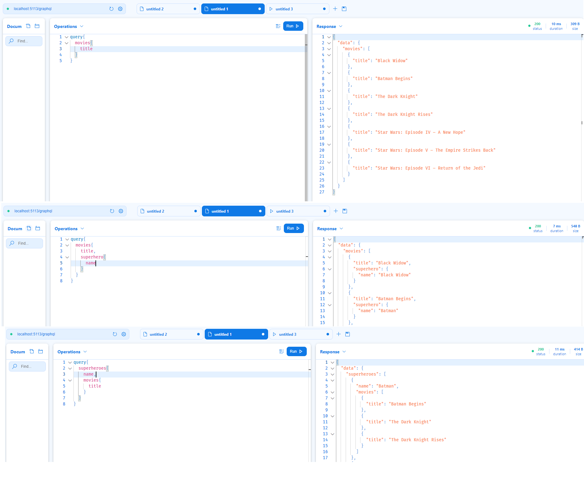

GraphQL支持三种操作符：
- Query
- Mutation
- Subscription
### Queries
对于每个GraphQL Server来说，Query操作符是必须要提供的。Query操作符类似Rest API的GET请求，用于执行无副作用的请求，不会改变服务器的状态，因此GraphQL引擎在解析并执行查询语句时，对于同一层级的属性，是并行执行的。
#### 配置ASP.NET CORE服务器支持Query
在.net 6.0中，要配置ASP.NET CORE服务器支持Query，只需安装Nuget包`HotChocolate.AspNetCore`并执行如下操作（除了HotChocolate，还可以使用graphql.net等框架）：
1. 添加Query Class:
```
public class Query
{
    public IQueryable<Movie> GetMovies([Service] ApplicationDbContext context) =>
        context.Movies;
}
```
其中Movie长这样，它有关联表Superhero：
```
public class Movie
{
    [Key]
    public Guid Id { get; set; }
    [Required(ErrorMessage = "The movie title is required")]
    public string Title { get; set; }
    public string? Description { get; set; }
    public string? Instructor { get; set; }
    public DateTime ReleaseDate { get; set; }

    [ForeignKey("SuperheroId")]
    public Guid SuperheroId { get; set; }
    public Superhero Superhero { get; set; }
}
```
2. 配置ASP.NET CORE服务器支持Query
```
builder.Services
    .AddGraphQLServer().AddQueryType<Query>();
```
经过这两步，一个支持Query操作的GraphQL Server就build好了。
启动程序，在执行第一次Query请求时，服务器会生成GraphQL的Schema（也叫SDL），类似这样：
```
type Query {
  movies(): [Movie!]!
}

type Movie {
  id: UUID!
  title: String!
  description: String
  instructor: String
  releaseDate: DateTime!
  superheroId: UUID!
  superhero: Superhero!
}

type Superhero {
  id: UUID!
  name: String!
  description: String!
  height: Float!
  superpowers: [Superpower!]!
  movies: [Movie!]!
}
```
HotChocolate自带的客户端名为`Banana Cake Pop.`,可通过`http://localhost:<port>/graphql/`来访问，第一次进去需要点击`Create Document`创建连接。
在这里可以灵活得查询Movie相关的属性：
- 可以只查询Movie中我们需要的属性（图1）
- 可以查询Movie的关联表（图2）
- 设置可以根据关联表superHero反查相关的Movie，这要借助EF Core支持（图2）



### 命名约定
本次使用的框架时HotChocolate，它会自动根据我们定义的Class，将其转换为GraphQL的Schema。
对比上文中的C#类`Movie`与GraphQL的Schema`Movie`，可以发现两者的关系：
- 首先Query.GetMovies方法的前缀Get默认被移除
- 首字母小写
- Query中的方法可以添加async来进行异步化，但这不会体现在SDL中

也可以使用注解来自定义名称直接的映射关系：
```c#
[GraphQLName("BookAuthor")]
public class Author
{
    [GraphQLName("fullName")]
    public string Name { get; set; }
}
```

### 数据类型
除了名称的转换，c#中的数据类型也要映射到GraphQL的类型。
GraphQL中常用的数据类型有Object Type和Scalar两类，此外还有Enums，Interfaces, Unions等。
其中Object Type会对应为c#的class，Scalar大致对应c#中的一部分值类型。
比如String, Boolean, Int都可以一一对应，但GraphQL还有一种特殊的类型ID，在C#中实现时可以使用string，int，Guid，同时显式地进行映射：
```
[GraphQLType(typeof(IdType))]
public int Id { get; set; }
```


- required for every GraphQL server
- side-effect free and are therefore parallelized by the execution engine.
- Only one query type can be registered using AddQueryType()
- If we want to split up our query type into multiple classes, we can do so using type extensions.
```
query {
  movies{
    title,
    description,
    superhero{
      name,
      superpowers{
        superPower,
      }
    }
  }
}
```
```
SELECT [m].[Title], CAST(1 AS bit), [s].[Name], [m].[Id], [s].[Id], [s0].[SuperPower], [s0].[Id]
    FROM [Movies] AS [m]
    INNER JOIN [Superheroes] AS [s] ON [m].[SuperheroId] = [s].[Id]
    LEFT JOIN [Superpowers] AS [s0] ON [s].[Id] = [s0].[SuperheroId]
    ORDER BY [m].[Id], [s].[Id]

```

## Mutations
- used to change data
- executed one by one
```
mutation {
  updateMovie(description: "fakeDesc12"){
    description
  }
}
```

## Subscriptions
- used to add real-time capabilities to our applications. 
- Clients can subscribe to events and receive the event data in real-time, as soon as the server publishes it.
```
subscription {
  movieAdded 
}

mutation {
  addMovieWithEvent(movie:"m2")
}
```

## Object Types

## Resolver
- A resolver is a generic function that fetches data from an arbitrary data source for a particular field.
- A resolver tree is a projection of a GraphQL operation that is prepared for execution.
```
query {
  me {
    name
    company {
      id
      name
    }
  }
}

```

- This tree will be traversed by the execution engine, starting with one or more root resolvers. 
- Field resolvers that are subselections of a field, can only be executed after a value has been resolved for their parent field. In the case of the above example this means that the name and company resolvers can only run, after the me resolver has finished. Resolvers of field subselections can and will be executed in parallel.
- Hot Chocolate automatically converts properties with a public get accessor to a resolver that simply returns its value.